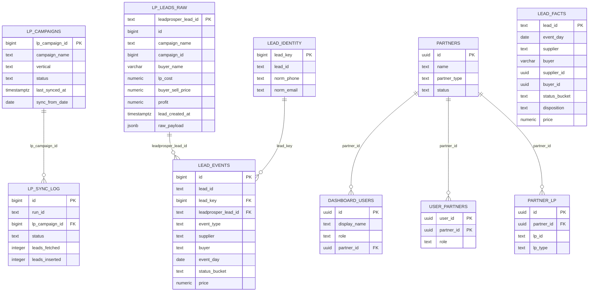

# Esquema de Base de Datos

Exportado desde Supabase/PostgREST OpenAPI para el esquema `public`.

## Vista General

La base alimenta un dashboard de performance de leads. El flujo principal es:

1. `lp_campaigns` define campanas de LeadProsper.
2. `lp_leads_raw` guarda leads crudos/importados.
3. `lead_identity` normaliza identidad del lead.
4. `lead_events` registra eventos asociados a leads.
5. `lead_facts` expone hechos limpios para dashboard y reportes.
6. `partners`, `partner_lp`, `dashboard_users` y `user_partners` controlan partners, usuarios y permisos.
7. Las vistas `v_*` y `vw_*` resumen metricas para analisis.

## Diagrama ER Simple

## Relaciones

### Claves Foraneas Explicitas

| Origen | Destino | Uso |
| --- | --- | --- |
| `lp_sync_log.lp_campaign_id` | `lp_campaigns.lp_campaign_id` | Auditoria de sync por campana |
| `dashboard_users.partner_id` | `partners.id` | Usuario vinculado a un partner |
| `user_partners.partner_id` | `partners.id` | Relacion usuario-partner many-to-many |
| `lead_events.lead_key` | `lead_identity.lead_key` | Evento vinculado a identidad normalizada |
| `lead_events.leadprosper_lead_id` | `lp_leads_raw.leadprosper_lead_id` | Evento vinculado al lead crudo |
| `partner_lp.partner_id` | `partners.id` | Mapping entre partner interno e ID externo LP |

### Relaciones Inferidas Por Uso

Estas columnas se usan como relaciones logicas, aunque el OpenAPI no las marco como FK explicita:

| Origen | Destino probable | Evidencia |
| --- | --- | --- |
| `lead_facts.supplier_id` | `partners.id` | Filtros y RPC usan supplier IDs contra partners |
| `lead_facts.buyer_id` | `partners.id` | Filtros y rankings usan buyer IDs contra partners |
| `lp_leads_raw.campaign_id` | `lp_campaigns.lp_campaign_id` | Campo de campana externa LP |
| `user_partners.user_id` | `auth.users.id` | Tabla de permisos por usuario Supabase Auth |
| `dashboard_users.id` | `auth.users.id` | Perfil creado con el mismo ID del usuario Auth |

## Tablas Base

### `partners`

Catalogo de partners internos.

| Columna | Tipo | Nota |
| --- | --- | --- |
| `id` | `uuid` | PK |
| `name` | `text` | requerido |
| `partner_type` | `text` | requerido; ejemplos: `supplier`, `buyer` |
| `status` | `text` | requerido |
| `report_email` | `text` |  |
| `notes` | `text` |  |
| `created_at` | `timestamptz` | requerido |

### `dashboard_users`

Perfil de usuario del dashboard.

| Columna | Tipo | Nota |
| --- | --- | --- |
| `id` | `uuid` | PK; probable `auth.users.id` |
| `display_name` | `text` | requerido |
| `role` | `text` | requerido; la app usa `admin` y `supplier` |
| `partner_id` | `uuid` | FK a `partners.id` |
| `created_at` | `timestamptz` | requerido |
| `updated_at` | `timestamptz` | requerido |

### `user_partners`

Relacion usuario-partner.

| Columna | Tipo | Nota |
| --- | --- | --- |
| `user_id` | `uuid` | PK; probable `auth.users.id` |
| `partner_id` | `uuid` | PK/FK a `partners.id` |
| `role` | `text` |  |
| `created_at` | `timestamptz` |  |

### `partner_lp`

Mapping entre partners internos y IDs externos de LeadProsper.

| Columna | Tipo | Nota |
| --- | --- | --- |
| `id` | `uuid` | PK |
| `partner_id` | `uuid` | FK a `partners.id` |
| `lp_id` | `text` | requerido |
| `lp_type` | `text` |  |
| `created_at` | `timestamptz` |  |

### `lp_campaigns`

Catalogo de campanas de LeadProsper y watermark de ingesta.

| Columna | Tipo | Nota |
| --- | --- | --- |
| `lp_campaign_id` | `bigint` | PK |
| `campaign_name` | `text` | requerido |
| `vertical` | `text` | derivada del nombre de campana |
| `status` | `text` | requerido |
| `last_synced_at` | `timestamptz` | ultimo sync |
| `sync_from_date` | `date` | fecha minima historica |
| `created_at` | `timestamptz` |  |
| `updated_at` | `timestamptz` |  |

### `lp_sync_log`

Auditoria de ejecuciones de ingesta desde LeadProsper.

| Columna | Tipo | Nota |
| --- | --- | --- |
| `id` | `bigint` | PK |
| `run_id` | `text` | UUID compartido por run |
| `lp_campaign_id` | `bigint` | FK a `lp_campaigns.lp_campaign_id` |
| `started_at` | `timestamptz` |  |
| `finished_at` | `timestamptz` |  |
| `status` | `text` | requerido |
| `leads_fetched` | `integer` | requerido |
| `leads_inserted` | `integer` | requerido |
| `leads_skipped` | `integer` | requerido |
| `date_from` | `date` |  |
| `date_to` | `date` |  |
| `error_message` | `text` |  |
| `created_at` | `timestamptz` |  |

### `lp_leads_raw`

Leads crudos/importados desde LeadProsper.

| Columna | Tipo | Nota |
| --- | --- | --- |
| `leadprosper_lead_id` | `text` | PK |
| `id` | `bigint` | requerido |
| `first_name`, `last_name` | `varchar` |  |
| `email`, `phone` | `varchar` |  |
| `address` | `text` |  |
| `city`, `state`, `zip_code` | `varchar` |  |
| `campaign_id` | `bigint` | ID LP |
| `campaign_name` | `text` |  |
| `supplier_campaign_name` | `text` |  |
| `buyer_name` | `varchar` |  |
| `buyer_campaign_name` | `varchar` |  |
| `buyer_status` | `varchar` |  |
| `lp_cost` | `numeric` |  |
| `buyer_sell_price` | `numeric` |  |
| `profit` | `numeric` |  |
| `lead_created_at` | `timestamptz` |  |
| `fetched_at` | `timestamptz` |  |
| `source` | `text` |  |
| `raw_payload` | `jsonb` | payload original |
| `status_final` | `varchar` |  |
| `buyer_callback_date` | `timestamptz` |  |
| `test` | `boolean` |  |

### `lead_identity`

Identidad normalizada para deduplicacion/tracking.

| Columna | Tipo | Nota |
| --- | --- | --- |
| `lead_key` | `bigint` | PK |
| `lead_id` | `text` |  |
| `norm_phone` | `text` |  |
| `norm_email` | `text` |  |
| `created_at` | `timestamptz` | requerido |

### `lead_events`

Eventos de leads normalizados.

| Columna | Tipo | Nota |
| --- | --- | --- |
| `id` | `bigint` | PK |
| `vertical` | `text` |  |
| `event_type` | `text` | requerido |
| `source_system` | `text` | requerido |
| `buyer` | `text` |  |
| `supplier` | `text` |  |
| `lead_id` | `text` |  |
| `norm_phone`, `norm_email` | `text` |  |
| `lead_key` | `bigint` | FK a `lead_identity.lead_key` |
| `event_ts` | `timestamptz` |  |
| `imported_at` | `timestamptz` | requerido |
| `event_day` | `date` |  |
| `event_month` | `date` |  |
| `status_bucket` | `text` |  |
| `status_raw` | `text` |  |
| `error_message` | `text` |  |
| `price` | `numeric` |  |
| `payload` | `jsonb` |  |
| `leadprosper_lead_id` | `text` | FK a `lp_leads_raw.leadprosper_lead_id` |

### `lead_facts`

Hechos listos para consultas del dashboard.

| Columna | Tipo | Nota |
| --- | --- | --- |
| `lead_id` | `text` | PK |
| `event_day` | `date` |  |
| `supplier` | `text` |  |
| `buyer` | `varchar` |  |
| `supplier_id` | `uuid` | relacion logica a `partners.id` |
| `buyer_id` | `uuid` | relacion logica a `partners.id` |
| `status_bucket` | `text` |  |
| `status_raw` | `varchar` |  |
| `disposition` | `text` |  |
| `price` | `numeric` |  |
| `source` | `text` |  |

### `disposition_map`

Mapeo de valores crudos de buyer hacia disposiciones operativas.

| Columna | Tipo | Nota |
| --- | --- | --- |
| `id` | `integer` | PK |
| `buyer_name` | `text` | requerido |
| `raw_value` | `text` | requerido |
| `disposition` | `text` | requerido |
| `sold` | `boolean` | requerido |
| `appointment_set` | `boolean` | requerido |
| `returned` | `boolean` | requerido |

### `buyer_reports`

Reportes cargados por buyer.

| Columna | Tipo | Nota |
| --- | --- | --- |
| `id` | `bigint` | PK |
| `upload_id` | `bigint` |  |
| `lead_id` | `text` |  |
| `buyer_name` | `text` |  |
| `appointment_issued`, `appointment_set` | `smallint` |  |
| `appointment_ids` | `text` |  |
| `gross_amount`, `net_amount` | `numeric` |  |
| `email`, `product`, `phone`, `reason` | `text` |  |
| `date` | `timestamptz` |  |
| `raw_payload` | `jsonb` |  |
| `created_at`, `imported_at` | `timestamptz` |  |

### `vertical_classification_rules`

Reglas para clasificar verticales.

| Columna | Tipo | Nota |
| --- | --- | --- |
| `id` | `integer` | PK |
| `vertical` | `varchar` | requerido |
| `pattern` | `text` | requerido |

## Vistas

| Vista | Descripcion |
| --- | --- |
| `v_leads_summary` | Totales generales: leads, aceptados, rechazados, revenue, cost, profit, ROI |
| `v_leads_by_buyer` | Ranking agregado por buyer |
| `v_leads_by_state` | Leads por estado/ciudad |
| `v_leads_hourly` | Performance por hora |
| `v_metrics_monthly_buyer` | Metricas mensuales por buyer |
| `vw_metrics_by_vertical` | Metricas por mes, buyer, supplier y vertical |
| `vw_internal_lead_report` | Reporte interno por lead con supplier, buyer, vertical y revenue/cost |

## Funciones RPC Usadas Por La App

| Funcion | Proposito |
| --- | --- |
| `fn_my_profile()` | Perfil del usuario autenticado |
| `fn_dashboard_kpis(...)` | KPIs principales del dashboard |
| `fn_dashboard_financials(...)` | Scorecards financieros |
| `fn_dashboard_trends(...)` | Serie temporal por dia/semana/mes |
| `fn_dashboard_suppliers(...)` | Ranking paginado de suppliers |
| `fn_dashboard_buyers(...)` | Ranking paginado de buyers |
| `fn_dashboard_geo(...)` | Distribucion geografica |
| `fn_dashboard_leads(...)` | Tabla paginada de leads |
| `fn_get_min_event_day()` | Fecha minima disponible |
| `fn_get_distinct_verticals()` | Lista de verticales |
| `fn_process_lp_leads_raw()` | Procesa crudos hacia hechos/eventos |

## Notas Operativas

- El esquema tiene varias vistas de reporting, por lo que no todas las entidades expuestas son tablas editables.
- Las relaciones marcadas como explicitas vienen del OpenAPI de Supabase con metadata FK.
- `lead_facts` parece ser la tabla principal consumida por las funciones de dashboard, aunque el detalle exacto vive dentro de las funciones RPC.
- Hay una credencial `SUPABASE_SERVICE_ROLE_KEY` disponible en archivos locales/scripts. Conviene rotarla si este repositorio se comparte fuera del entorno privado.
